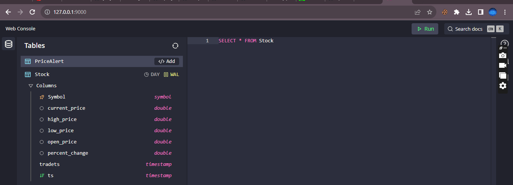
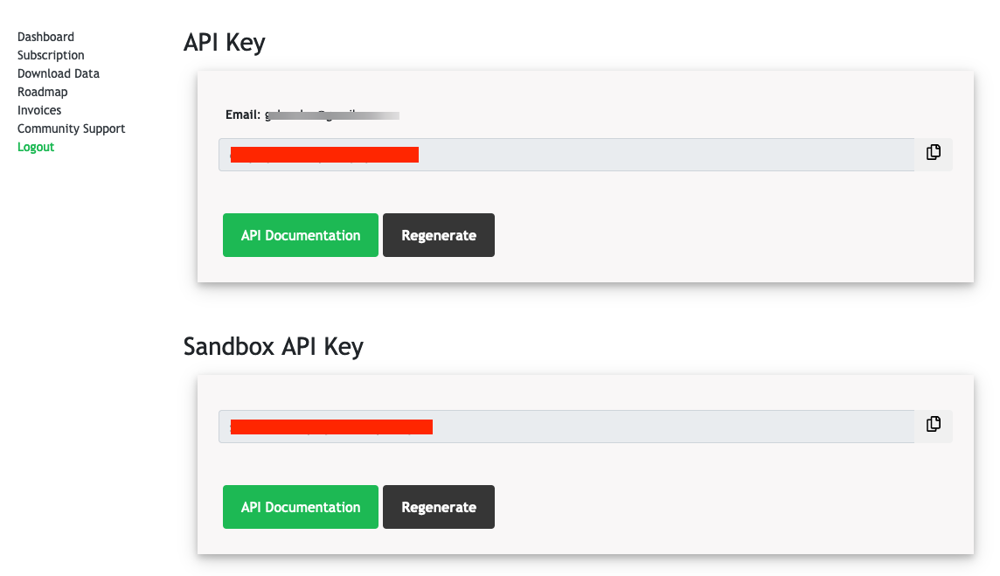
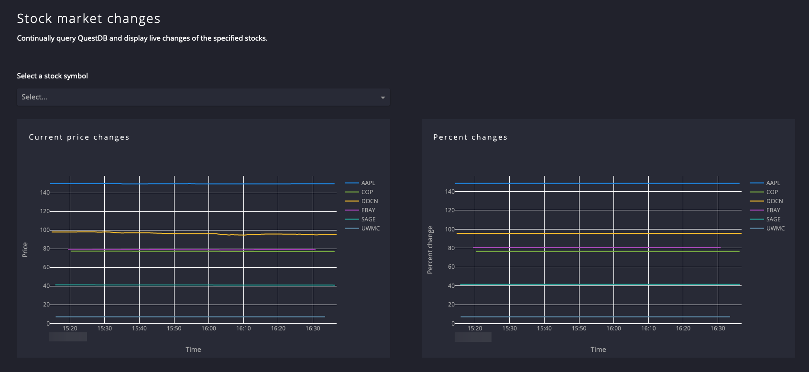
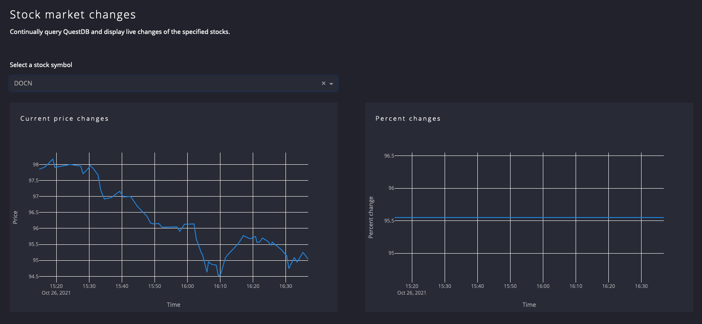

# Real Time Stock Price Tracker

## Introduction

If you're working with large amounts of data, efficiently storing raw information will be your first obstacle. The next challenge is to make sense of the data utilizing analytics. One of the fastest ways to convey the state of data is through charts and graphs.

In this project, we will create a real-time streaming dashboard using QuestDB, Celery, Redis, Plotly, and Dash. It will be a fun project with excellent charts to quickly understand the state of a system with beautiful data visualizations.

## Project Overview

The project will be built from two main components:

- A backend that periodically fetches user-defined stock data from [Finnhub](https://finnhub.io/), and
- A FrontEnd that utilizes Plotly and Dash to visualize the gathered data on interactive charts

We will use Celery backed by Redis as the message broker and QuestDB as storage to periodically fetched data.

## Prerequisites

- Python 3.8 or Later.
- Docker & Docker Compose Installed.
- Finnhub account and sandbox API key.

## Project Setup

### Creating a New Project

First of all, we are going to create empty directories for our project root and the Python module:

```shell
mkdir -p streaming-dashboard/app
# streaming-dashboard
# └── app
```

### Installing QuestDB & Redis

To install the services required for our project, we are using Docker and Docker Compose to avoid polluting our host machine. Within the project root, let's create a file, called docker-compose.yml. This file describes all the necessary requirements the project will use; later on we will extend this file with other services too.

```yaml
version: "3"
volumes:
  questdb_data: {}
services:
  redis:
    image: "redis:latest"
    ports:
      - "6379:6379"
  questdb:
    image: "questdb/questdb:latest"
    volumes:
      - questdb_data:/root/.questdb/db
    ports:
      - "9000:9000"
      - "8812:8812"
```

Here we go! When you run `docker-compose up`, QuestDB and Redis will fire up.

After starting the services, we can access QuestDB's interactive console on [http://127.0.0.1:9000](http://127.0.0.1:9000/).

### Creating the database table

We could create the database table later, but we will take this opportunity and create the table now since we have already started QuestDB. 
Connect to QuestDB's interactive console, and run the following SQL statement:

```sql
CREATE TABLE
      Stock(Symbol SYMBOL CAPACITY 5 CACHE INDEX, -- we are in fact just checking 3
             current_price DOUBLE,
             high_price DOUBLE,
             low_price DOUBLE,
             open_price DOUBLE,
             percent_change DOUBLE,
             tradets TIMESTAMP, -- timestamp of the trade
             ts TIMESTAMP)      -- time of insert in our table
      timestamp(ts)
PARTITION BY DAY;
```

After executing the command, we will see a success message in the bottom left corner, confirming that the table creation was successful and the table appears on the right-hand side's table list view.



Voilá! The table is ready for use.

## Creating Workers Using Celery

### Define Python dependencies

As mentioned, our project will have two parts. For now, let's focus on the routine jobs that will fetch the data from Finnhub. As is the case of every standard Python project, we are using `requirements.txt` to define the dependencies the project will use. Place the `requirements.txt` in your project root with the
content below:

```bash
finnhub-python==2.4.5   # The official Finnhub Python client
pydantic[dotenv]==1.8.2 # We will use Pydantic to create data models
celery[redis]==5.1.2    # Celery will be the periodic task executor
psycopg2-binary         # We are using QuestDB's PostgreSQL connector
sqlalchemy==1.4.2       # SQLAlchemy will help us executing SQL queries
dash==2.0.0             # Dash is used for building data apps
pandas==1.4.3           # Pandas will handle the data frames from QuestDB
plotly==5.3.1           # Plotly will help us with beautiful charts
```

Next, Create a virtualenv and install
the dependencies:

```bash
$ virtualenv -p python3 my_env
$ source my_env/bin/activate
$ pip install -r requirements.txt
```

### Setting up the DB connection

Since the periodic tasks would need to store the fetched quotes, we need to connect to QuestDB. Therefore, we create a new file in the `app` package, called `db.py`. This file contains the `SQLAlchemy` engine that will serve as the base for our connections.

### Define the worker settings

Before we jump right into the implementation, we must configure Celery. To create a configuration used by both the workers and the dashboard, create a `settings.py` file in the `app` package. We will use `pydantic`'s BaseSettings to define the configuration. This helps us to read the settings from a `.env` file, environment variable, and prefix them if needed.

Ensuring that we do not overwrite any other environment variables, we will set the prefix to `SMD` that stands for "Stock Market Dashboard", our application.

Let's create a `.env` file in the project root, next to `docker-compose.yml`:


As you may assume, you will need to get your API key for the sandbox environment at this step. To retrieve the key, the only thing you have to do is sign up to Finnhub, and your API key will appear on the dashboard after login.



### Create the periodic task

In the first few lines of the file `app/worker.py`, we imported the requirements that are needed to fetch and
store the data.

After importing the requirements, we configure the Finnhub client and Celery to use the Redis broker we defined in the application settings.

To fetch the data periodically per stock symbol, we need to programmatically create a periodic task for every symbol we defined in the `app/settings.py`.

The code will register a new periodic per stock symbol after Celery is connected to the broker.

The last step is to define the `fetch` task that does the majority of the work.

Using the Finnhub `client`, we get a quote for the given symbol. After the quote
is retrieved successfully, we prepare a SQL query to insert the quote into the database. At the end of the function, as the last step, we open a connection to QuestDB and insert the new quote.

Congratulations! The worker is ready for use; let's try it out!

Execute the command below in a new terminal window within the virtualenv, and wait some seconds to let Celery kick in:

```bash
python3 -m celery --app app.worker.celery_app worker --beat -l info -c 1
```

Soon, you will see that the tasks are scheduled, and the database is slowly filling.

### Checking in on what we've built so far

Before proceeding to the visualization steps, let's have a look at what we have
built so far:

1. We created the project root.
2. A `docker-compose.yml` file to manage related services.
3. `app/settings.py` that handles our application configuration
4. `app/db.py` configuring the database engine, and
5. Last but not least, `app/worker.py` that handles the hard work, fetches, and
   stores the data.

At this point, we should have the following project structure:

```txt
├── app
│   ├── db.py
│   ├── settings.py
│   └── worker.py
└── docker-compose.yml
```

## Visualize the data with Plotly and Dash

### Getting static assets
As the first step, create an `assets` directory next to the `app` package with the structure below:

```
├── app
│   ├── db.py
│   ├── settings.py
│   └── worker.py
├── assets
├── .env
├── docker-compose.yml
```

The `assets/style.css` will define the styling for our application. Dash will save us from boilerplate code, so the `assets` directory will be used by default in conjunction with the stylesheet in it.


### Setting up the application

Create a `main.py` file in the `app` package.

After imports, in the first few lines, we define constants for setting a graph update frequency (`GRAPH_INTERVAL`) and colors that will be used for coloring the graph (`COLORS`).

After that, we define two helper functions, `now` and `get_stock_data`. While `now` is responsible only for getting the current time in UTC (as Finnhub returns the date in UTC too), the `get_stock_data` does more. It is the core of our front-end application, it fetches the stock data from QuestDB that workers
inserted.

Next, we define the initial data frame and the application.

The initial data frame (`df`) will contain the latest 5 hours of data we have. This is needed to pre-populate the application with some data we have. The application definition `app` describes the application's
title, asset folder, and some HTML meta tags used during rendering.


We are now ready to try our application with actual data. Make sure that the Docker containers are started and execute `PYTHONPATH=. python3 app/main.py` from the project root:

```shell
$ PYTHONPATH=. python3 app/main.py
```

Navigate to http://127.0.0.1:8050/, to see the application in action.



To select only one stock, in the dropdown field choose the desired stock symbol
and let the application refresh.



## Licencing

MIT

## Summary

We've seen how to schedule tasks in Python, store data in QuestDB, and create beautiful dashboards using Plotly and Dash.

Happy Coding!